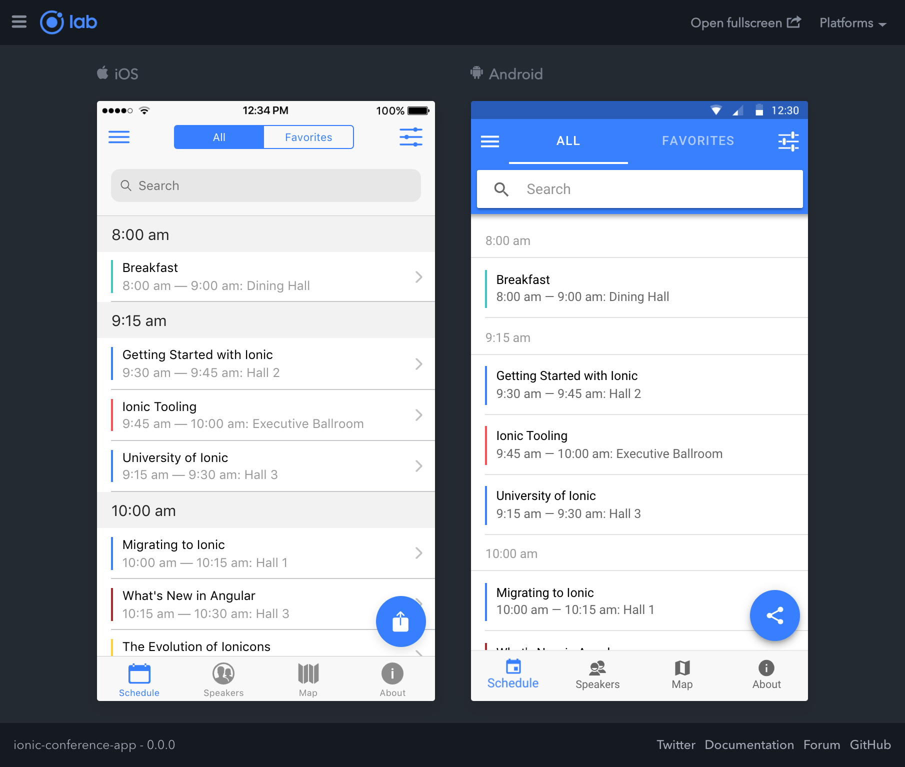
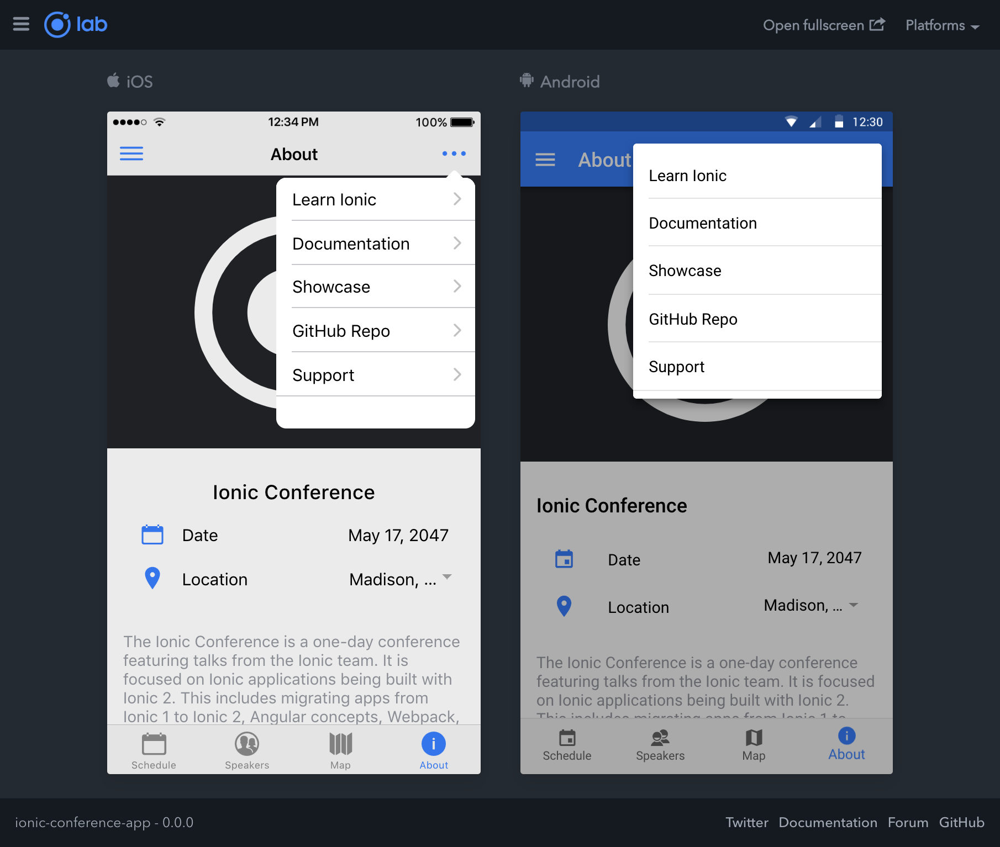

# Sistema de Monitoramento de Silos (APP)

Esta interface foi desenvolvida utilizando como base o template [conference](https://github.com/ionic-team/ionic-conference-app) utilizando o Ionic Framework e Angular.

## Table of Contents
- [Getting Started](#getting-started)
- [App Preview](#app-preview)
- [Deploying](#deploying)
  - [Progressive Web App](#progressive-web-app)
  - [Android](#android)
  - [iOS](#ios)

## Getting Started

* [Download the installer](https://nodejs.org/) for Node.js 6 or greater.
* Install the ionic CLI globally: `npm install -g ionic`
* Clone this repository: `git clone https://github.com/ionic-team/ionic-conference-app.git`.
* Execute `npm install` from the project root.
* Execute `ionic serve` in a terminal from the project root.
* Profit. :tada:

_Note: See [How to Prevent Permissions Errors](https://docs.npmjs.com/getting-started/fixing-npm-permissions) if you are running into issues when trying to install packages globally._

## App Preview

All app preview screenshots were taken by running `ionic serve --lab` on a retina display.

- [Schedule Page](https://github.com/ionic-team/ionic-conference-app/blob/master/src/app/pages/schedule/schedule.html)

  

- [About Page](https://github.com/ionic-team/ionic-conference-app/blob/master/src/app/pages/about/about.html)

  

- To see more images of the app, check out the [screenshots directory](https://github.com/ionic-team/ionic-conference-app/tree/master/resources/screenshots)!

## Deploying

### Progressive Web App

1. Execute `npm run ng serve`

### Android

1. Execute `ionic cordova run android --prod`

### iOS

1. Execute `ionic cordova run ios --prod`
