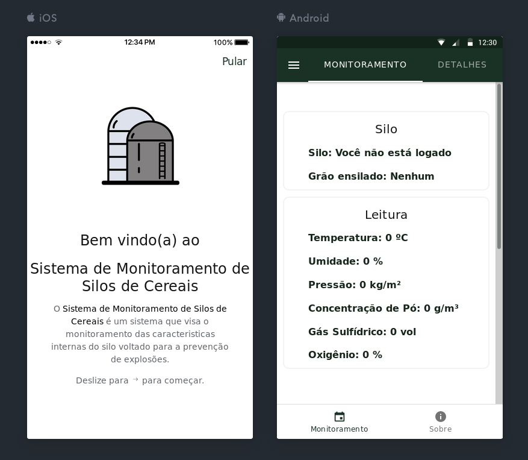
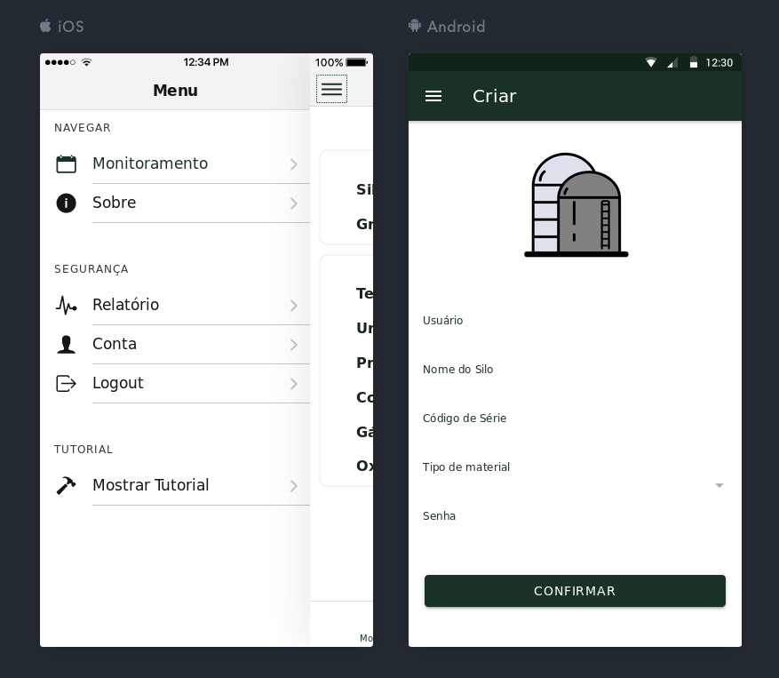
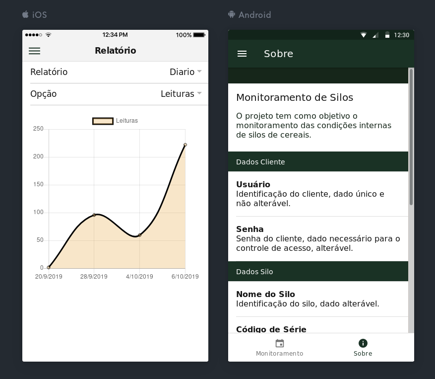
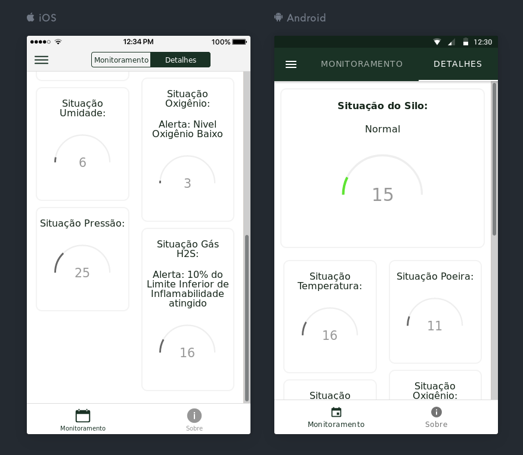

# Sistema de Monitoramento de Silos (APP)

Esta interface foi desenvolvida utilizando como base o template [conference](https://github.com/ionic-team/ionic-conference-app) utilizando o Ionic Framework e Angular.

## Tópicos
- [Iniciando](#iniciando)
- [Demonstração](#demonstração)
- [Executando](#executando)
  - [Web App](#progressive-web-app)
  - [Android](#android)
  - [iOS](#ios)

## Iniciando

Este aplicativo faz parte do desenvolvimento do projeto de trabalho de conclusão de curso.

## Demonstração

Todos os prints foram retirados utilizando o comando `ionic serve --lab`.

- [Demo 1](https://github.com/abelsco/sistemaExplocaoApp/tree/master/src/app/pages)

  

- [Demo 2](https://github.com/abelsco/sistemaExplocaoApp/tree/master/src/app/pages)

  

- [Demo 3](https://github.com/abelsco/sistemaExplocaoApp/tree/master/src/app/pages)

  

- [Demo 4](https://github.com/abelsco/sistemaExplocaoApp/tree/master/src/app/pages)

  

## Executando

Para executar o projeto é necessário a configuração do ambiente. O ambiente requer:

* [Node.js](https://nodejs.org/) para instalar o Node.js.
* Para instalar o Ionic CLI basta rodar o comando: `npm install -g ionic`, tambem é necessário ativar o suporte do Ionic para o Angular 8.
* Clone este repositório.
* Vá para a pasta raiz do projeto.
* Execute `npm install` em um terminal para instalar as dependencias do projeto.
* Execute `ionic serve` para vizualizar o projeto.

### Web App

Para visualizar o Web App.

1. Execute `npm run ng serve`

### Android

Para executar no Android.

1. Execute `ionic cordova run android --prod`

### iOS

Para executar no iOS.

1. Execute `ionic cordova run ios --prod`
